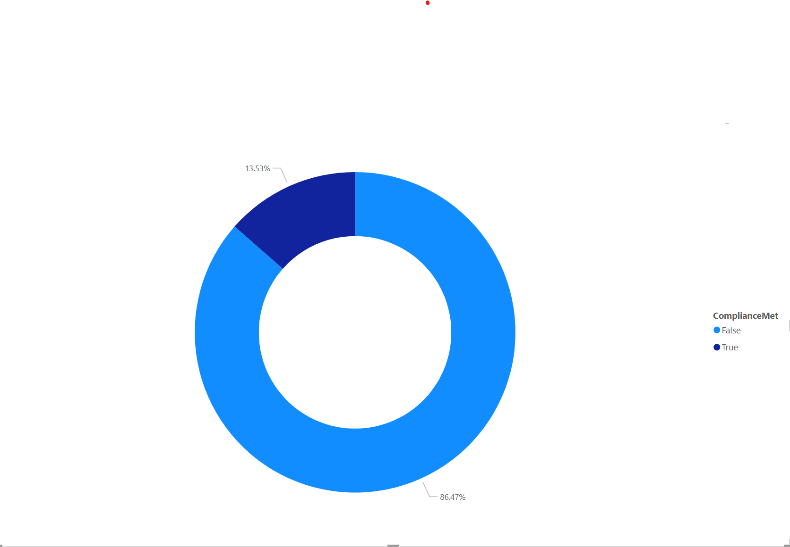

# 🧬 Sepsis Compliance ETL Project

This is a data engineering and visualization project built using  mock data. The goal is to measure patient compliance with sepsis bundle metrics.
Hospitals must report on timely care for patients with sepsis and septic shock. This project extracts clinical data, calculates compliance with SEP-1 measures, and visualizes results.
## 📊 Dashboard Preview

## 📂 Files

- [Power BI Template (`.pbit`)](SepsisComplianceTemplate.pbit)
 
- [Source Repo on GitHub](https://github.com/Codehound1/sepsis-compliance-etl)

---

Built by Jimmy Ajuwa[Codehound1](https://github.com/Codehound1)
