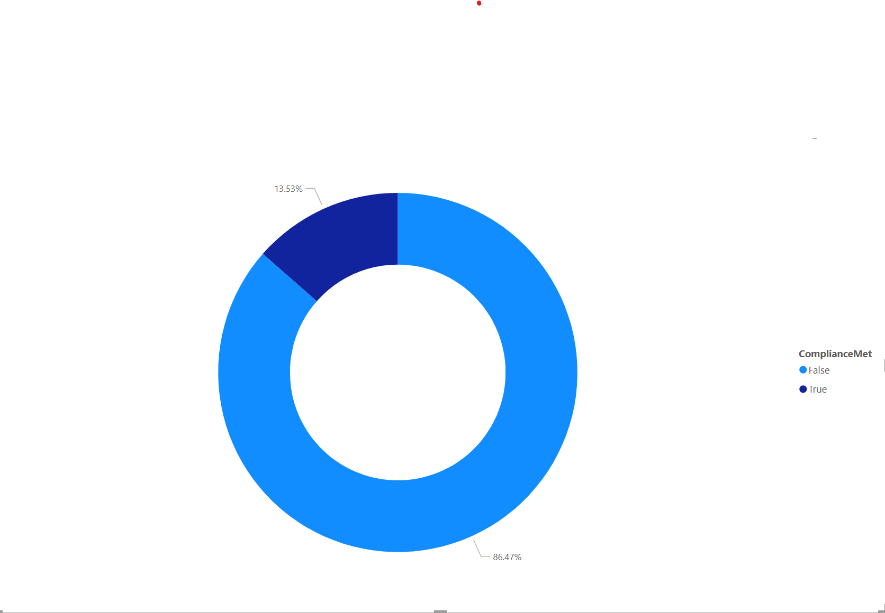

# 🧬 Sepsis Compliance ETL Project

This is a data engineering and visualization project built using  mock data. The goal is to measure patient compliance with sepsis bundle metrics.

## 📊 Dashboard Preview

## 📂 Files

- [Power BI Template (`.pbit`)](SepsisComplianceTemplate.pbit)
 
- [Source Repo on GitHub](https://github.com/Codehound1/sepsis-compliance-etl)

---

Built by [Codehound1](https://github.com/Codehound1)
